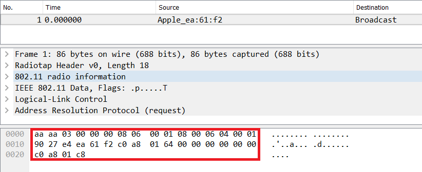
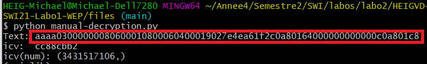
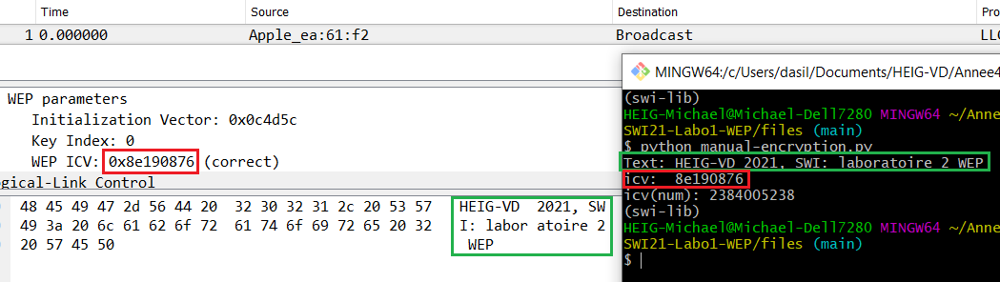

# Sécurité des réseaux sans fil

## Laboratoire 802.11 Sécurité WEP

**Auteurs: Michaël da Silva, Nenad Rajic**

### 1. Déchiffrement manuel de WEP

### 2. Chiffrement manuel de WEP

Le message est bien celui que nous avons défini et l'ICV est correct. Pour que le message fonctionne, il faut qu'il contienne 36 caractères/octets.

### 3. Fragmentation

